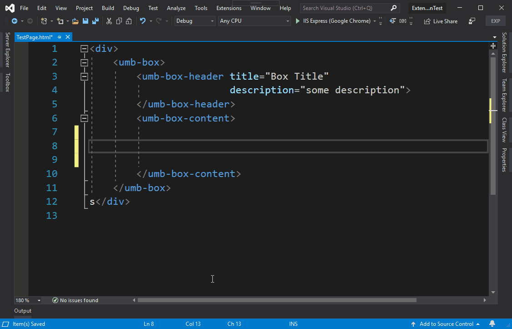

# UmbSense
Extension for Visual Studio (2019) - that adds auto-completion for Umbraco Backoffice UI Elements in html files. 

#### Logo

The package logo uses the [Rocket](https://thenounproject.com/term/rocket/2217243/) (by [Adrien Coquet](https://thenounproject.com/coquet_adrien/)) icon from the [Noun Project](https://thenounproject.com), licensed under [CC BY 3.0 US](https://creativecommons.org/licenses/by/3.0/us/).
